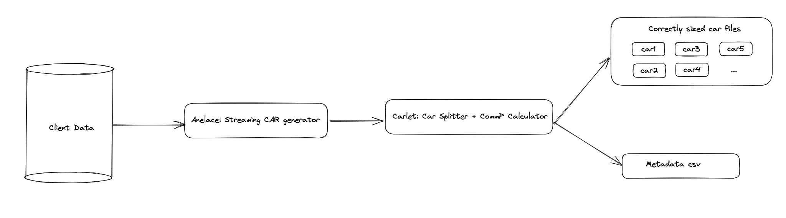

# go-fil-dataprep

An end to end data preparation tool to onboard data to filecoin. This involves generating
car files, splitting them up to be of a user-specified size and calculating commP, i.e.
all the steps involved in [data
preparation](https://github.com/filecoin-project/data-prep-tools/tree/main/docs) in order
to make storage deals on [filecoin](https://filecoin.io)



## Installation

```
go install github.com/anjor/go-fil-dataprep/cmd/data-prep@latest
```

## Usage

The cli supports 2 commands -- `fil-data-prep` and `split-and-commp`.

### fil-data-prep

This command transforms data into a bunch of car files sized "correctly" (target size
provided as an input), calculates commP and saves all of this data in a metadata file. It
also prints out the root cid for the IPLD dag to stdout.

The `--output` flag will optionally prefix resulting car filenames with the provided string

```
$data-prep fil-data-prep --size 100000000000 --metadata meta.csv --output test 5gb-filecoin-payload.bin
root cid = bafybeihsshuadcxukrkye76kfeci5mbs7v7o5iq32d2xhzygxnj6s7asw4
```

```
$ cat meta.csv
timestamp,car file,root_cid,piece cid,padded piece size
2023-05-10T13:04:47Z,test-baga6ea4seaqnxhbabidowdpd6pl3bombnh2jw3r2uu2s37ippoam5vergcxmyny.car,bafybeihsshuadcxukrkye76kfeci5mbs7v7o5iq32d2xhzygxnj6s7asw4,baga6ea4seaqnxhbabidowdpd6pl3bombnh2jw3r2uu2s37ippoam5vergcxmyny,8589934592
```
### split-and-commp

This command takes in a car file and splits it into smaller car files of the provided size (roughly). It also calculates commp at the same time and writes it out to a metadata file.

```
$data-prep split-and-commp --size 10000 --output a --metadata ma.csv file.car
```

